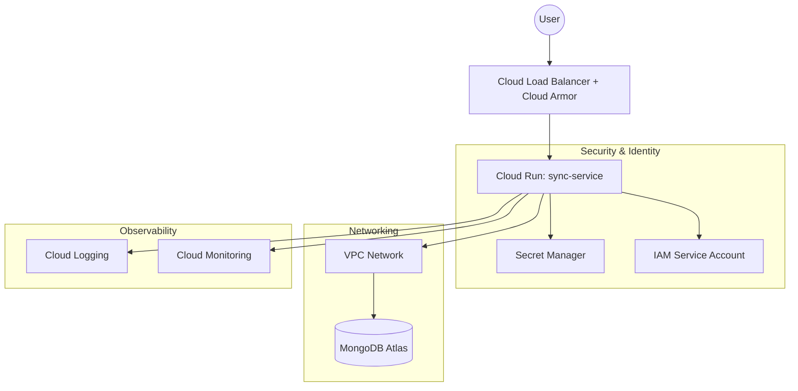

# Infrastructure Design: sync-service on GCP

## 1. Architectural Overview
Our design focuses on **security**, **auto-scaling**, and **cost-optimization** using a modern serverless-first approach on Google Cloud Platform.

### Architecture Diagram

## 2. Component Justifications

### Compute Choice: Cloud Run
**Why not GKE?** GKE (Kubernetes) has high overhead costs for control planes and requires more management.
**Why not Compute Engine?** While we used it in Part 1, it requires managing OS patches and scaling is slower (minutes vs seconds).
**Cloud Run Benefits:**
- **Cost:** Pay-per-use model with "Scale to Zero" is ideal for startup constraints.
- **Scaling:** Automatically handles traffic spikes instantly.
- **Simplicity:** Focus on code, not infrastructure.

### MongoDB Hosting: MongoDB Atlas (Managed)
Instead of self-hosting on GCP VMs, we use MongoDB Atlas.
- **Reliability:** Automated backups and 99.9% uptime out of the box.
- **Security:** Private Link/VPC Peering keeps data off the public internet.
- **Startup Friendly:** The "M0/M10" tiers are significantly cheaper than running a 3-node HA cluster on GCE.

### Networking & Ingress
- **Cloud Load Balancing (HTTPS):** Acts as the single entry point.
- **Cloud Armor (WAF):** Provides protection against SQL injection, XSS, and DDoS attacks.
- **Private Access:** The service communicates with MongoDB via a **Serverless VPC Access Connector**, ensuring data stays within the private network.

### Secrets & IAM
- **Least Privilege:** The service runs under a dedicated Service Account with only `secretmanager.secretAccessor` and `logging.logWriter` roles.
- **Secret Manager:** All sensitive data (DB passwords, API keys) are stored in GCP Secret Manager, not in application properties.

### Logging & Monitoring
- **Native Integration:** All `stdout` logs from the Spring Boot app are automatically captured by **Cloud Logging**.
- **Metrics:** We monitor CPU/Memory usage and Request Latency via **Cloud Monitoring**.
- **Alerting:** Critical errors trigger PagerDuty alerts (as integrated in our Jenkins pipeline).
